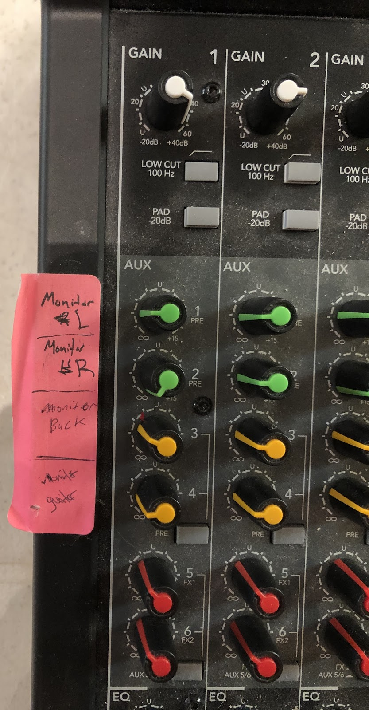

# Sound Board Guide

Some of this may be out of date as it was mostly copy-pasted from a google doc created by a former member of the tech team.

## Stage Set Up

All equipment should be in sound equipment room or desk by sound board

1. Turn on sound system components
    * Check to make sure power bar behind receivers is on (it shouldn’t need to be turned on)
    * Turn on sound board (the switch is on the back on the right side)
    * Turn on “Handheld” microphone receiver
        * Turn on receiver labeled “W/L 1” for Pastor's microphone
        * The DBX and the Peavey boxes/receivers should be on already. No need to touch or adjust this equipment. Core team will make changes with these if needed.
2. Set up choir microphone (stored in long cardboard tube) or 2 mics for praise band.
3. Set up the congregational microphones that go in front of the stage (these go in the same storage bag)
4. Set up cordless mic. Check battery level. If it’s low (at 1 bar), then replace the battery. Spare batteries are in the sound desk.
5. Cables should be on stage already
6. Test microphones - make sure green light is on by the volume slider
    * Vocal mics have rounded windscreens (find out name/model #)
    * Instrument mics have no windscreens (find out name/model #)
    * Choir Mic will be on channel 10 (currently not labeled)
7. Pastor's Cordless mic and power pack
    * Make sure the battery is not low - if it shows it is low at all, replace
    * Make sure the power pack is clipped to the outside of Pastor's left front pocket (It seems that having the power pack in his pocket causes some problems with transmission).

## Sound Board Operation

* Headphones attached to the sound board help you to hear what is being recorded on the computer. Try to find balance what sounds good both in house and on the headphones. Generally, it will sound the same.
* Solo buttons for Aux 5 & 6 (red knobs) are on the right end of the row. If you push these solo buttons you get to hear what is going to the recording in the headphones.

* Top Row - GAIN - these knobs allow you to adjust how much sound the mic picks up

* AUX Rows - MONITOR controls (see photo above)
    * See pink label on the side of the board for the monitor assignment.
    * See labels on bottom for what part of the mix is going to that monitor.
    * To adjust the monitor levels, adjust the green or yellow knob assigned to that row.
        * Choir monitor is normally 2nd from the top (Monitor Right)
        * Praise Band Set Up for Monitors
        * Left monitor - for piano?
        * Right monitor - for vocalists
        * Monitor back - drums
        * Monitor guitar - guitars

* EQ Rows

* Blue Knobs - can be used to adjust hi, mid, and low sounds for each channel
* White Knob - adjusts frequency (when do you use this?)
* Bottom Row - Sliders
* Use the slider to adjust the volume for each channel
* Sliders only control house and recording volumes, not the monitors
* CHANNELS
* 1 - Guitar Acoustic
* 2 - Bass
* 3 - Guitar Electric
* 4 & 5 - Drum Low & Drum High - Leave slider all the way down. The other mics will pick up enough drum noise for the recording. Turning these sliders up can cause other sound to be drowned out.
* 6 - Piano
* 7 - Vox Left - Praise Band only
* 8 - Vox Right - Praise Band only
* 9 - Vox Piano
* 10 - Choir Mic
* 11 - 22 - normally not used
* 23 & 24 - Congregation Left and Right
* 25 - Pastor's wireless mic
* 26 - Wireless Mic - used for solos, prayer after offering, etc.
* 27 - ?
* 28 - 30 - normally not used
* 31/32 - “MAC” slider - controls sound coming from the computer for special music or music played before the worship service
* Right Side: “LIVE” and “RECORD” - No need to adjust. Should be set at just above 5 (below U).
* Right Side: “MASTER” controls volume for all channels
* Right Side: “LIVE COMP” and “REC COMP” - No need to adjust. Should be set at just above 5 (below U).
* If the volume is all the way up for a specific channel and you want more of that instrument or voice:
* Push the “SOLO” button on the right side of the slider.
* Look at the green/yellow/red LEDs on the far right side of the board.
* If the green lights are not getting close to yellow, then turn up the gain until it starts to get close to yellow or just turning yellow when instrument or vocalist is playing or singing at full volume.
* The buttons next to the sliders:
    * 1-2, 3-4 buttons assign that channel to the matching subgroup sliders on the right side of the board (don’t pay attention to yellow and pink labels)
    * LR is sound sent directly to the house (Main Mix slider)
    * Note: Try not to have more than one of these 3 buttons pressed in. It will significantly increase the volume of that channel in the mix
    * What to do if there is feedback:
    * Turn down the gain on the channel / microphone that is most likely causing the feedback
    *  If it’s not obvious, then look at each channel with the “SOLO” button pressed and determine which one is causing red LEDs to turn on, then turn down the gain on that channel
    * What to do if there is crackling?

## During the Service

1. Main Focus: The majority of the work is turning the mics on and off at the right times by using either the mute button or pushing the slider all the way down.
2. Remember where the slider was before you push it all the way down.
3. Leaving all the mics on all the time will create feedback.
4. Congregational Mics
5. During music have the slider set at “U” (in between the 5s).
6. Slide down to 20 to avoid taking in too much background noise during the sermon.
7. If you have a problem, reach out to another member of the tech team (whoever is available/not leading worship or in choir)

## After the Service

1. Put all the microphones away
2. Turn off receivers and sound board.
3. We do not need to  turn off the power bar.
4. Make sure that things are set up for Sunday School and operate the board during Sunday School.
